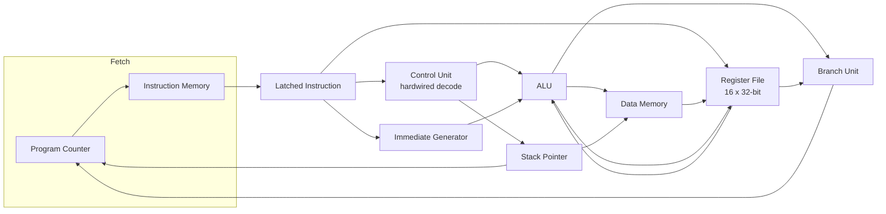
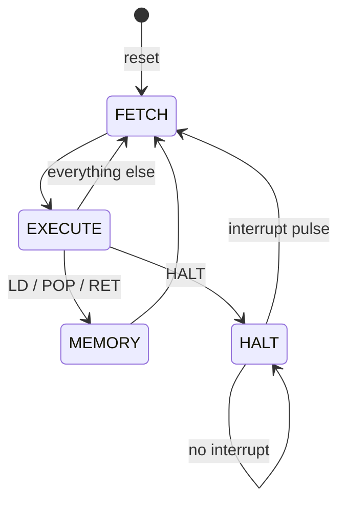

# 32-bit RISC Processor (Verilog)

A 32-bit, 16-register, multicycle RISC processor built from scratch in
Verilog: a hardwired instruction decoder, a behavioural FSM control path,
a custom 26-instruction ISA covering all five required addressing modes,
a hand-written assembler/toolchain, and a from-scratch Booth's-multiplier
and Hamming-weight program verified against independent reference models
in simulation.

Built for IIT Kharagpur's Computer Organization and Architecture lab
(Autumn 2025), implementing the full assignment specification end to
end: a custom ISA, a hardwired control path, and both algorithms from
the final demonstration (Booth's multiplication and total Hamming
weight), each verified in simulation. See [Design decisions](#design-decisions)
below for the reasoning behind a few of the less obvious choices.

## Highlights

- **Custom 26-instruction ISA** (`docs/ISA.md`) covering register,
  immediate, base+offset, PC-relative, and indirect addressing.
- **Multicycle FSM control path** (`FETCH -> EXECUTE -> [MEMORY] -> FETCH`,
  plus a `HALT`/resume-on-interrupt state) driven by a hardwired
  (case-statement) instruction decoder.
- **Hardware Booth's-multiplier and Hamming-weight programs**, each
  verified against 10/4 independent test vectors including signed
  overflow-adjacent edge cases.
- **A small two-pass assembler** (`tools/assemble.py`) with labels,
  PC-relative branch resolution, and `.hex`/`.coe` output, so every
  program in `programs/` is generated and regression-tested rather
  than hand-encoded.
- **125+ simulation checks across 5 testbenches**, run with one command
  (`sim/run_tests.sh`), using the open-source Icarus Verilog simulator --
  no vendor tools needed to verify correctness.
- **FPGA-synthesizable, vendor-neutral memories**: instruction/data RAM
  use the standard "registered read from an array" coding template that
  Vivado (and other tools) infer as Block RAM, rather than a
  GUI-generated, non-portable Xilinx IP core.

## Architecture





Instruction and data memory both have a one-cycle registered read
(matching real Block RAM), so the FSM exists specifically to give
load-type instructions (`LD`, `POP`, `RET`) an extra `MEMORY` cycle to
wait for that read before writing back or redirecting the PC. See
`rtl/risc_processor.v` for the full cycle-by-cycle reasoning in comments.

## Repository layout

```
rtl/            Synthesizable Verilog (alu, control_unit, risc_processor, ...)
sim/            Testbenches + sim/run_tests.sh (one-command verification)
tools/          assemble.py -- the two-pass assembler/toolchain
programs/       .asm sources plus their assembled .hex / .coe output
fpga/           Board-level top modules + Nexys4 DDR .xdc constraints
docs/ISA.md     Full opcode table, encoding, and design-decision rationale
```

## Verification

```
$ bash sim/run_tests.sh
== tb_alu ==
*** ALL ALU TESTS PASSED ***
== tb_processor_sum ==
*** SUM_5_TO_1 TEST PASSED ***
== tb_booth ==
*** ALL BOOTH TESTS PASSED (10 cases) ***
== tb_hamming ==
*** ALL HAMMING TESTS PASSED ***
== tb_isa_selftest ==
*** ISA SELF-TEST: ALL CHECKS PASSED ***
```

- `tb_alu.v` -- every ALU function against an independent reference
  computation, plus 200 randomized cross-checks.
- `tb_processor_sum.v` -- the addendum's own regression program (sum 5
  down to 1) end to end through the full FSM datapath.
- `tb_booth.v` -- 16x16-bit signed Booth's multiplication against
  `$signed` multiply, across 10 vectors including `INT16_MIN * INT16_MIN`
  and `INT16_MAX * INT16_MAX`.
- `tb_hamming.v` -- Hamming weight of a 5-word array against an
  independent popcount reference, across 4 vectors.
- `tb_isa_selftest.v` -- a 180-instruction integration program exercising
  every instruction not already covered above (`AND/OR/XOR/NOR/NOT`,
  `SL/SRL/SRA`, `INC/DEC/SLT/SGT`, every `*I` immediate form, `LUI`,
  `MOVE`/`MOVE ,SP`, `CMOV`, `PUSH/POP`, indirect `CALL`/`RET`, `BMI`) --
  25 checks, all passing.

Requires [Icarus Verilog](http://iverilog.icarus.com/) (`iverilog`/`vvp`)
and Python 3 on `PATH`.

## Running a program

```bash
python tools/assemble.py programs/booth_mult.asm --hex build/booth_mult.hex --coe programs/booth_mult.coe --listing build/booth_mult.lst
```

`--hex` is for simulation (`$readmemh`), `--coe` is for Vivado's Block
Memory Generator IP Catalog, `--listing` prints address/encoding/label
alongside each instruction for debugging.

## FPGA demonstration

`fpga/top_booth.v` and `fpga/top_hamming.v` are ready-to-synthesize top
modules for the two "Final Program Demonstration" projects (Booth's
result in `R2`, Hamming weight in `R3`), built on the shared
`fpga/top_autonomous.v` wrapper. Constrain either with
`fpga/nexys4ddr.xdc` (Nexys4 DDR / Nexys A7):

| Signal | Pin | Function |
|---|---|---|
| `clk` | E3 | 100 MHz system clock |
| `reset` | BTNC | synchronous reset / run |
| `sw0` | J15 | 0 = lower 16 bits, 1 = upper 16 bits of the result |
| `led[15:0]` | (16 LEDs) | selected half of the result register |

Press reset once; the processor runs to completion at full clock speed
and freezes in `HALT`, and the result is visible on the LEDs immediately
(no extra "read" step). `programs/booth_data.hex`/`.coe` and
`programs/hamming_data.hex`/`.coe` hold example inputs -- swap in a
TA-/grader-supplied data `.coe` at the same addresses to test other
inputs (`docs/ISA.md` documents the address convention each program
expects).

## Design decisions

A few choices in this design aren't the only reasonable option, so here's
the reasoning behind them:

- **Every opcode gets its own explicit control-unit case**, rather than
  deriving control signals arithmetically from the opcode number. It reads
  like a real control ROM / microcode table -- which is also what the
  assignment's "RTL micro-operations" deliverable is asking for -- and it
  keeps every instruction's encoding independent of every other one's.
- **`CALL` takes a register operand (indirect addressing)** rather than an
  immediate target, since indirect addressing is one of the five modes the
  assignment requires and it's a natural fit for "jump to a computed
  subroutine address."
- **Data memory is addressed in 8-byte-aligned words**, and `PUSH`/`POP`/
  `CALL`/`RET` move the stack pointer by 8 accordingly, matching the
  assignment's "all loads and stores occur from addresses that are
  multiples of 8."
- **`BR`'s 26-bit immediate is sign-extended**, so an unconditional branch
  can jump backward as well as forward -- needed for loops written with
  `BR` instead of a conditional branch.
- **Instruction/data memory use a vendor-neutral BRAM-inference coding
  template** (see the Highlights section) instead of a GUI-configured
  Xilinx IP core, so the same RTL simulates in an open-source simulator and
  synthesizes on real hardware without a Vivado-specific dependency.
- **The FPGA board wrapper's ports match its `.xdc` constraints file
  exactly** (`clk`/`reset`/`sw0`/`led[15:0]`), and the clock constraint is
  10 ns for the board's 100 MHz pin.
