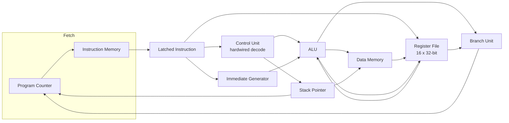
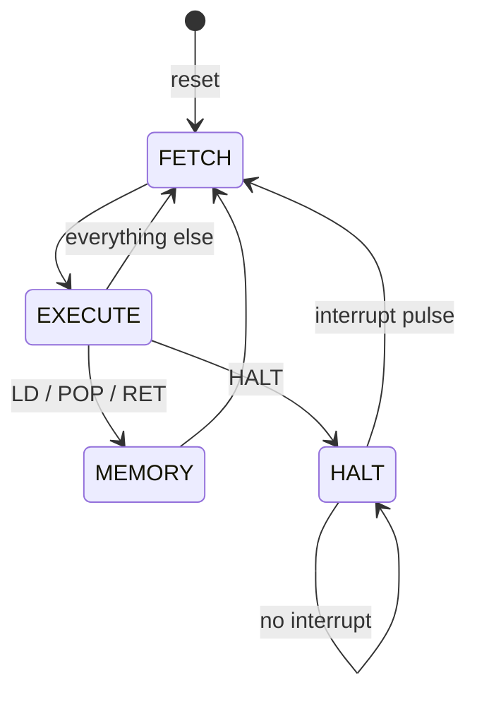

# 32-bit RISC Processor (Verilog)

A 32-bit, 16-register, multicycle RISC processor built from scratch in
Verilog: a hardwired instruction decoder, a behavioural FSM control path,
a custom 26-instruction ISA covering all five required addressing modes,
a hand-written assembler/toolchain, and a from-scratch Booth's-multiplier
and Hamming-weight program verified against independent reference models
in simulation.

Originally built for IIT Kharagpur's Computer Organization and Architecture
lab (Autumn 2025); this repository is a from-the-ground-up rebuild against
the original assignment specs after the working copy of the project was
lost, keeping only the partial reference implementation as a starting
point (see [Rebuild notes](#rebuild-notes) below for what that involved).

## Highlights

- **Custom 26-instruction ISA** (`docs/ISA.md`) covering register,
  immediate, base+offset, PC-relative, and indirect addressing.
- **Multicycle FSM control path** (`FETCH -> EXECUTE -> [MEMORY] -> FETCH`,
  plus a `HALT`/resume-on-interrupt state) driven by a hardwired
  (case-statement) instruction decoder.
- **Hardware Booth's-multiplier and Hamming-weight programs**, each
  verified against 10/4 independent test vectors including signed
  overflow-adjacent edge cases.
- **A small two-pass assembler** (`tools/assemble.py`) with labels,
  PC-relative branch resolution, and `.hex`/`.coe` output -- because
  hand-assembling machine code (which is how this project's sample
  programs were originally written) is exactly how the previous version
  of this project ended up with test programs that used opcodes the
  processor didn't decode.
- **125+ simulation checks across 5 testbenches**, run with one command
  (`sim/run_tests.sh`), using the open-source Icarus Verilog simulator --
  no vendor tools needed to verify correctness.
- **FPGA-synthesizable, vendor-neutral memories**: instruction/data RAM
  use the standard "registered read from an array" coding template that
  Vivado (and other tools) infer as Block RAM, rather than a
  GUI-generated, non-portable Xilinx IP core.

## Architecture





Instruction and data memory both have a one-cycle registered read
(matching real Block RAM), so the FSM exists specifically to give
load-type instructions (`LD`, `POP`, `RET`) an extra `MEMORY` cycle to
wait for that read before writing back or redirecting the PC. See
`rtl/risc_processor.v` for the full cycle-by-cycle reasoning in comments.

## Repository layout

```
rtl/            Synthesizable Verilog (alu, control_unit, risc_processor, ...)
sim/            Testbenches + sim/run_tests.sh (one-command verification)
tools/          assemble.py -- the two-pass assembler/toolchain
programs/       .asm sources plus their assembled .hex / .coe output
fpga/           Board-level top modules + Nexys4 DDR .xdc constraints
docs/ISA.md     Full opcode table, encoding, and design-decision rationale
```

## Verification

```
$ bash sim/run_tests.sh
== tb_alu ==
*** ALL ALU TESTS PASSED ***
== tb_processor_sum ==
*** SUM_5_TO_1 TEST PASSED ***
== tb_booth ==
*** ALL BOOTH TESTS PASSED (10 cases) ***
== tb_hamming ==
*** ALL HAMMING TESTS PASSED ***
== tb_isa_selftest ==
*** ISA SELF-TEST: ALL CHECKS PASSED ***
```

- `tb_alu.v` -- every ALU function against an independent reference
  computation, plus 200 randomized cross-checks.
- `tb_processor_sum.v` -- the addendum's own regression program (sum 5
  down to 1) end to end through the full FSM datapath.
- `tb_booth.v` -- 16x16-bit signed Booth's multiplication against
  `$signed` multiply, across 10 vectors including `INT16_MIN * INT16_MIN`
  and `INT16_MAX * INT16_MAX`.
- `tb_hamming.v` -- Hamming weight of a 5-word array against an
  independent popcount reference, across 4 vectors.
- `tb_isa_selftest.v` -- a 180-instruction integration program exercising
  every instruction not already covered above (`AND/OR/XOR/NOR/NOT`,
  `SL/SRL/SRA`, `INC/DEC/SLT/SGT`, every `*I` immediate form, `LUI`,
  `MOVE`/`MOVE ,SP`, `CMOV`, `PUSH/POP`, indirect `CALL`/`RET`, `BMI`) --
  25 checks, all passing.

Requires [Icarus Verilog](http://iverilog.icarus.com/) (`iverilog`/`vvp`)
and Python 3 on `PATH`.

## Running a program

```bash
python tools/assemble.py programs/booth_mult.asm --hex build/booth_mult.hex --coe programs/booth_mult.coe --listing build/booth_mult.lst
```

`--hex` is for simulation (`$readmemh`), `--coe` is for Vivado's Block
Memory Generator IP Catalog, `--listing` prints address/encoding/label
alongside each instruction for debugging.

## FPGA demonstration

`fpga/top_booth.v` and `fpga/top_hamming.v` are ready-to-synthesize top
modules for the two "Final Program Demonstration" projects (Booth's
result in `R2`, Hamming weight in `R3`), built on the shared
`fpga/top_autonomous.v` wrapper. Constrain either with
`fpga/nexys4ddr.xdc` (Nexys4 DDR / Nexys A7):

| Signal | Pin | Function |
|---|---|---|
| `clk` | E3 | 100 MHz system clock |
| `reset` | BTNC | synchronous reset / run |
| `sw0` | J15 | 0 = lower 16 bits, 1 = upper 16 bits of the result |
| `led[15:0]` | (16 LEDs) | selected half of the result register |

Press reset once; the processor runs to completion at full clock speed
and freezes in `HALT`, and the result is visible on the LEDs immediately
(no extra "read" step). `programs/booth_data.hex`/`.coe` and
`programs/hamming_data.hex`/`.coe` hold example inputs -- swap in a
TA-/grader-supplied data `.coe` at the same addresses to test other
inputs (`docs/ISA.md` documents the address convention each program
expects).

## Rebuild notes

The version of this project recovered from an earlier attempt had the
right general shape (datapath modules, a control unit, a register file)
but was missing pieces the [assignment
documents](https://github.com/AsimShareef/32-bit-RISC-processor) actually
require, and had several bugs once checked against them:

- **No ALU module existed at all.** `risc_processor.v` instantiated one
  that was never committed.
- **No FSM control path**, despite the assignment explicitly asking for
  one ("Implementing the control path using behavioural FSM design").
  The old `control_unit.v` was purely combinational, and the datapath
  compensated with a confusing, buggy double-buffered instruction-latch
  scheme that desynchronized during `HALT`.
- **Half the ISA was unimplemented**: `AND, OR, XOR, NOR, NOT, SL, SRL,
  SRA, INC, DEC, SLT, SGT, HAM, MOVE` don't appear anywhere in the old
  code, despite being required.
- **No immediate form of `ADD` could be encoded.** The old control unit
  derived `aluOp` arithmetically from the opcode (`aluOp = opcode[3:0]`),
  which collided with the register-register opcode at 0 -- so `ADDI`,
  used in *every* sample program in the assignment, had no valid
  encoding.
- **Indirect addressing**, one of the five addressing modes the
  assignment explicitly requires, was never implemented anywhere.
- **The data memory used 4-byte addressing**; the spec requires every
  load/store address to be a multiple of 8.
- **The two sample programs didn't match the control unit's opcode map.**
  Decoding them by hand turned up opcodes (`0x31`-`0x33`, `0x38`, `0x3E`)
  the control unit never handles -- both programs even ended with the
  same word, apparently meant as `HALT`, at an opcode that isn't `HALT`.
  Loaded as-is, neither would ever halt.
- **`BR`'s immediate was zero-extended**, so it could only ever jump
  forward.
- **The constraints file didn't match any top-level module in the repo**
  (`reset`/`sw0`/`led` vs. the processor's actual `rst`/`interrupt` ports)
  and its clock constraint was wrong for the clock it names (`-period
  20.00` on a claimed 100 MHz `E3` pin is 50 MHz).

This repository fixes all of the above: a clean opcode table with an
explicit case per instruction (`docs/ISA.md`), a proper multicycle FSM,
the full ISA, indirect addressing via `CALL`, 8-byte-aligned data memory,
sign-extended `BR`, a board wrapper whose ports actually match its
constraints file -- and, instead of two hand-assembled and (as it turned
out) broken sample programs, an assembler plus two working, independently
verified reference implementations of the algorithms the final
demonstration actually asks for.
